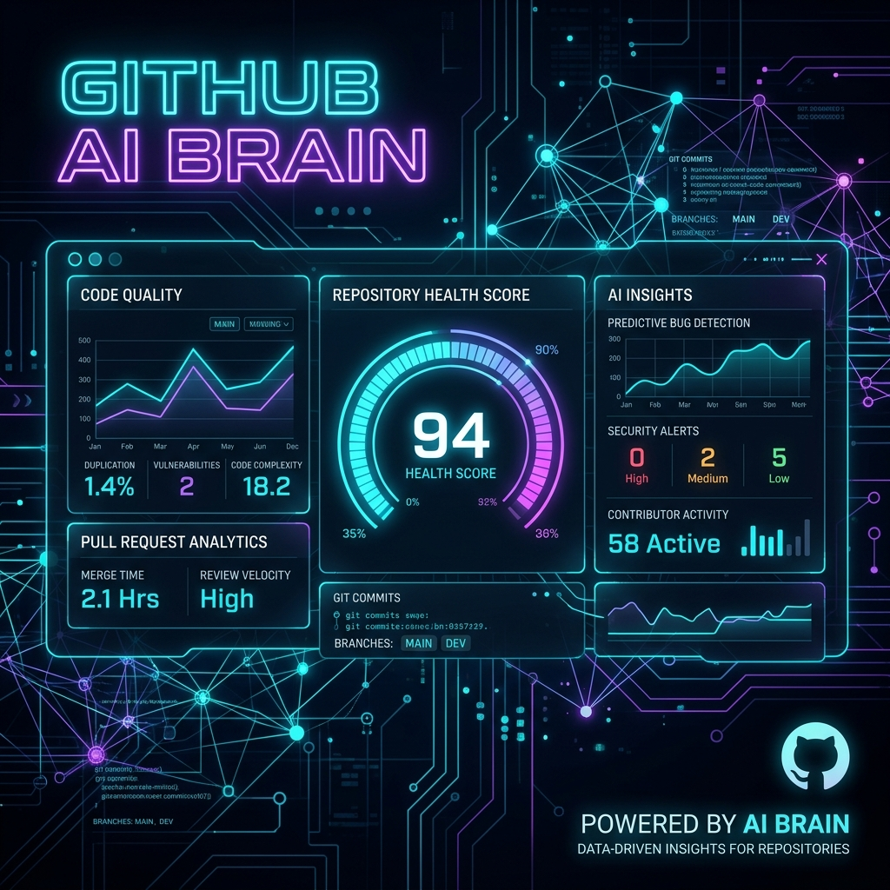

# GitHub AI Brain — Merge Wars Edition

<p align="center">
  
</p>

<p align="center">
  <a href="https://github.com/Abhi2006-cloud/merge-wars-github-brain/actions"></a>
  <a href="https://www.python.org/downloads/"></a>
  <a href="LICENSE"></a>
  <a href="https://github.com/psf/black"></a>
</p>

An intelligent repository analysis, competitive benchmarking, and organization auditing engine that evaluates software project health, contributor velocity, issue dynamics, and CI/CD workflow statuses across individual repositories and entire GitHub organizations.

---

## 💡 Why GitHub AI Brain?

Managing multiple open-source or enterprise software repositories requires continuous visibility into contributor velocity, open issue bottlenecks, pull request review latency, and CI/CD build stability. Manually tracking these metrics across dozens of repositories is inefficient and fragmented.

**GitHub AI Brain** solves this engineering challenge by aggregating raw metadata from the GitHub REST API into actionable intelligence. It calculates an objective **Activity Health Score (0–100)** based on contribution recency and issue/PR resolution patterns, providing developers, engineering managers, and open-source maintainers with immediate insights through natural language terminal queries or non-interactive CLI flags.

---

## ✨ Features

- 🏥 **Repository Health Scoring**: Computes a weighted 0–100 activity score and assigns health ratings (`🟢 Excellent`, `🟡 Good`, `🟠 Fair`, `🔴 Needs Attention`) based on recent commits, open issues, and PR velocity.
- 📊 **Competitive Benchmarking**: Performs side-by-side comparative analysis between competing or related repositories (e.g. `tensorflow/tensorflow` vs `pytorch/pytorch`).
- 🏢 **Organization-Level Audits**: Aggregates total stars, forks, open issue bottlenecks, and average activity scores across an entire GitHub organization (e.g., `facebook`, `microsoft`).
- ⚙️ **CI/CD Workflow Monitoring**: Tracks GitHub Actions run conclusions and highlights failing build pipelines.
- 📁 **JSON & CSV Export Engine**: Export structured health audits, competitive rankings, and organization reports directly to `.json` or `.csv` files for downstream analytics.
- 💬 **Natural Language Query REPL**: Interactive terminal interface that routes user queries to specific sub-systems using pattern-matching and intent detection.
- ⚡ **Non-Interactive CLI Execution**: Full support for command-line arguments (`--analyze`, `--compare`, `--org`, `--export`) for scriptable CI/CD pipelines and background automation.
- 🔑 **Resilient Rate-Limit Handling**: Supports authenticated execution (5,000 req/hr) with graceful degradation under unauthenticated mode (60 req/hr).

---

## 🏗️ Architecture

```text
┌────────────────────────────────────────────────────────────────────────┐
│                   Terminal / Command-Line Interface                    │
│             (main.py / cli_interface.py / argparse / REPL)             │
└───────────────────────────────────┬────────────────────────────────────┘
                                    │
                                    ▼
┌────────────────────────────────────────────────────────────────────────┐
│                     Natural Language Query Router                      │
│                      (Intent & Handle Extraction)                      │
└──────────────┬──────────────────────────────────────────┬──────────────┘
               │                                          │
               ▼                                          ▼
┌─────────────────────────────┐                ┌─────────────────────────┐
│    GitHubAIBrain Engine     │                │    MultiRepoAnalyzer    │
│  (Health Scoring & Exports) │                │   (Org Audit Engine)    │
└──────────────┬──────────────┘                └──────────┬──────────────┘
               │                                          │
               └────────────────────┬─────────────────────┘
                                    │
                                    ▼
┌────────────────────────────────────────────────────────────────────────┐
│                        GitHub REST API Service                         │
│                      (httprequests / endpoints)                        │
└───────────────────────────────────┬────────────────────────────────────┘
                                    │
                                    ▼
                        GitHub Cloud Infrastructure
```

---

## 🛠️ Tech Stack

- **Core Runtime**: Python 3.8+
- **API Integration**: GitHub REST API v3 via `requests`
- **Environment Management**: `python-dotenv`
- **Testing Suite**: `pytest` unit test suite with mocked API dependencies & `unittest` integration tests
- **CI/CD & DevOps**: GitHub Actions Matrix, Docker multi-stage builds

---

## 📂 Project Structure

```text
merge-wars-github-brain/
├── main.py                   # Main CLI & interactive REPL entry point
├── github_agent.py           # Core GitHubAIBrain engine & health scoring logic
├── multi_repo.py             # Organization-level auditor & multi-repo benchmarking
├── cli_interface.py          # Interactive terminal UI & CLI flag parser
├── demo.py                   # End-to-end feature demonstration script
├── test_agent.py             # Integration test suite against live API
├── assets/                   # Repository graphics and architecture visual assets
│   └── banner.png
├── tests/                    # Unit test suite with offline mocks
│   ├── test_github_agent.py
│   ├── test_multi_repo.py
│   ├── test_cli_interface.py
│   └── test_export.py
├── .github/                  # CI/CD workflows and issue/PR community templates
│   ├── workflows/ci.yml
│   ├── ISSUE_TEMPLATE/
│   └── PULL_REQUEST_TEMPLATE.md
├── Dockerfile                # Multi-stage lightweight Docker image build
├── .dockerignore             # Docker build exclusion rules
├── pyproject.toml            # Package build & dependency metadata
├── requirements.txt          # Python runtime dependencies
├── LICENSE                   # MIT License
├── CONTRIBUTING.md           # Contribution guidelines
├── CODE_OF_CONDUCT.md        # Contributor Covenant Code of Conduct
├── .env.example              # Template environment configuration
└── .gitignore                # Git exclusion rules
```

---

## 🚀 Getting Started

### Prerequisites

- **Python**: 3.8 or higher
- **GitHub Personal Access Token** *(Optional, recommended)*: Classic token with `repo` and `read:org` scopes for 5,000 requests/hour limit.

### Installation

1. **Clone the Repository**
   ```bash
   git clone https://github.com/your-username/merge-wars-github-brain.git
   cd merge-wars-github-brain
   ```

2. **Create and Activate Virtual Environment**
   ```bash
   python3 -m venv .venv
   source .venv/bin/activate
   ```

3. **Install Dependencies**
   ```bash
   pip install --upgrade pip
   pip install -e ".[dev]"
   ```

4. **Configure Environment Variables**
   ```bash
   cp .env.example .env
   ```
   Edit `.env` and add your GitHub token:
   ```env
   GITHUB_TOKEN=ghp_your_actual_token_here
   ```

---

## 💻 Usage & Commands

### 1. Command-Line Arguments (Non-Interactive)

```bash
# Analyze repository health
python3 main.py --analyze microsoft/vscode

# Compare multiple repositories side-by-side
python3 main.py --compare tensorflow/tensorflow pytorch/pytorch

# Perform organization audit and export to JSON
python3 main.py --org facebook --export json --out facebook_audit.json

# Export repository health audit to CSV
python3 main.py --analyze kubernetes/kubernetes --export csv

# Execute single natural language query
python3 main.py --query "Show open issues in facebook/react"
```

### 2. Interactive REPL Mode

Launch without arguments to start the interactive shell:
```bash
python3 main.py
```

Example interactive queries:
- `Analyze microsoft/vscode repository`
- `Compare tensorflow/tensorflow vs pytorch/pytorch`
- `Analyze organization facebook`
- `Show open issues in facebook/react`
- `List pull requests in kubernetes/kubernetes`
- `Check workflow status in pytorch/pytorch`

Special built-in commands inside REPL:
- `help` / `h` / `?`: Display detailed command reference.
- `demo`: Run interactive query selection menu.
- `clear` / `cls`: Clear terminal output.
- `exit` / `quit` / `q`: Exit application safely.

---

## 🐳 Docker Deployment

You can build and run **GitHub AI Brain** inside a container:

```bash
# Build Docker image
docker build -t github-ai-brain .

# Run interactive CLI mode
docker run -it --rm -e GITHUB_TOKEN=$GITHUB_TOKEN github-ai-brain

# Run single query via container
docker run --rm -e GITHUB_TOKEN=$GITHUB_TOKEN github-ai-brain --analyze microsoft/vscode
```

---

## 🧪 Testing

Run the full, fast, offline unit test suite:

```bash
python3 -m pytest tests/ -v
```

The test suite covers:
- Weighted activity score calculations
- ISO timestamp recency evaluation (`_is_recent`)
- Workflow run status aggregation
- Intent & repository handle regex extraction
- Organization report markdown formatting
- CLI argument parsing & command routing
- JSON & CSV report export formatting

---

## ⚖️ License

Distributed under the MIT License. See [LICENSE](LICENSE) for details.
